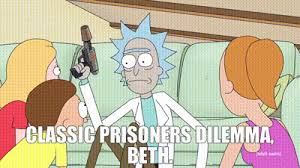

# 🎮  Game Theory Arcade

**[🎮  Play Now →](https://mayurhulke.github.io/game-theory-arcade/)**

**Learn game theory through interactive play!**

  

## Purpose

**Why This Project Exists:**

I thought it would be cool to actually *feel* game theory instead of just reading about it in textbooks. Like, everyone's heard of the Prisoner's Dilemma, but have you ever experienced that moment where you're staring at "cooperate" vs "betray" and genuinely don't know what to do? Or watched a shared resource die because everyone (including you) took just a little too much?

Traditional economics courses teach these concepts with equations and graphs, but they miss the psychological tension. I wanted to build something where you experience the gut feeling of "should I free-ride on Wikipedia donations?" or "should I overfish before my neighbors do?" - and then see that thousands of other people made the exact same "irrational" choice you did.

Basically, I wanted to make game theory hit different - not as abstract theory, but as something you feel in your decisions.

**What Makes This Different:**

1. **Play Against Real Human Patterns** - AI opponents use strategies based on decades of behavioral economics research, not random choices
2. **Compare Yourself to Thousands** - Your decisions are compared to real players, showing you're not as rational as you think
3. **Learn Through Consequences** - Experience why rational individual choices create collective disasters
4. **Bridge Theory and Reality** - Educational content connects abstract game theory to climate change, overfishing, Wikipedia, and other real-world problems

**The Core Insight:**

These games reveal a fundamental truth: **humans are not purely rational economic agents**. We care about fairness (Ultimatum Game), we cooperate even when betrayal pays more (Prisoner's Dilemma), we sometimes fish sustainably even when greed is profitable (Tragedy of Commons), and we contribute to public goods even when free-riding is smarter (Public Goods Game).

Understanding these patterns isn't just academic - it explains why international climate agreements fail, why fisheries collapse, why Wikipedia struggles for funding, and why cooperation requires more than mutual benefit. It shows why we need institutions, regulations, and social norms to solve collective action problems.

**Who This Is For:**

- Students learning behavioral economics or game theory
- Anyone curious about why humans make seemingly irrational decisions
- People who want to understand cooperation, fairness, and collective action problems
- Educators teaching decision-making, economics, or social dilemmas

## 🎮 Available Games

### Prisoner's Dilemma ✅
Trust or betray? See how you compare to thousands of real players!

**[Play Now →](https://mayurhulke.github.io/game-theory-arcade/prisoners-dilemma/)**

- 10 rounds of strategic decision-making
- Real-time comparison with other players
- 4 behavioral archetypes (Altruist, Strategist, Opportunist, Defector)
- Live statistics and insights

### Ultimatum Game ✅
Split $10 with a stranger. How fair will you be? How much unfairness will you tolerate?

**[Play Now →](https://mayurhulke.github.io/game-theory-arcade/ultimatum-game/)**

- 5 rounds alternating between proposer and responder roles
- AI opponents with realistic behavioral economics patterns
- Social comparison with percentile rankings
- 5 personality types (Egalitarian, Fair-Minded, Strategic, Risk-Taker, Maximizer)
- Live crowd statistics showing average offers and rejection rates

### Tragedy of the Commons ✅
Fish from a shared lake. Will you be sustainable or grab what you can before others do?

**[Play Now →](https://mayurhulke.github.io/game-theory-arcade/tragedy-commons/)**

- 10 rounds of fishing decisions with 4 AI villagers
- Resource regenerates each round but can be depleted
- AI strategies: Greedy, Sustainable, Moderate, Adaptive
- Lake health tracking and survival comparison
- 4 player archetypes (Conservationist, Pragmatist, Opportunist, Exploiter)
- Real-world examples: Grand Banks collapse, Elinor Ostrom's research

### Public Goods Game ✅
Contribute to the public fund or free-ride? See why Wikipedia needs donation drives.

**[Play Now →](https://mayurhulke.github.io/game-theory-arcade/public-goods/)**

- 10 rounds of contribution decisions ($0-$10 per round)
- Public fund gets doubled and split equally
- AI citizens: Altruist, Free-Rider, Conditional Cooperator, Reciprocator
- Track wealth vs. optimal cooperative outcome
- 6 player archetypes (Altruist → Total Free-Rider)
- Real-world applications: Wikipedia, PBS, climate action

## Features

- **Retro Arcade Aesthetic** - Pixel fonts, CRT effects, neon glows
- **Real Human Data** - Compare your choices to actual players
- **Interactive Insights** - Charts showing cooperation patterns
- **Social Comparison** - Percentiles, rankings, and archetypes
- **Firebase Integration** - Live crowd statistics (free tier)

## License

MIT License - feel free to fork and create your own game theory games!

---
